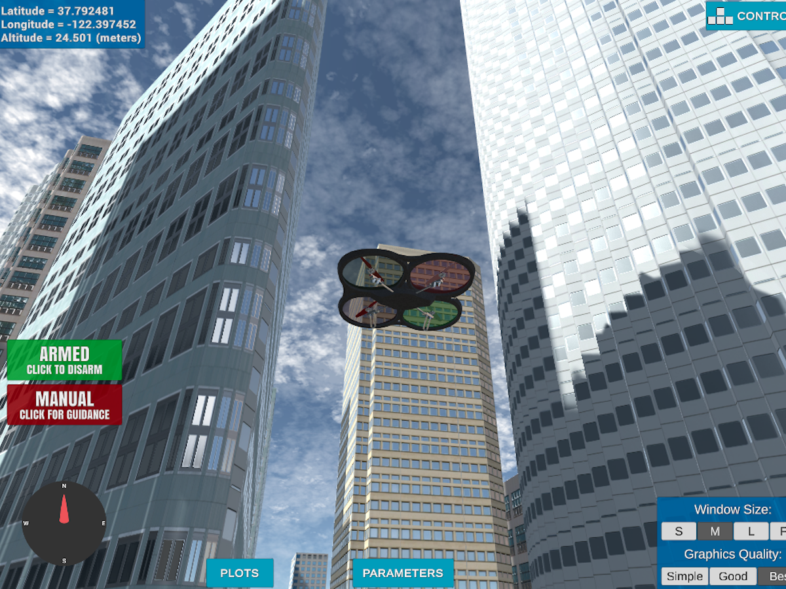

## Project: 3D Motion Planning


---


# Required Steps for a Passing Submission:
1. Load the 2.5D map in the colliders.csv file describing the environment.
2. Discretize the environment into a grid or graph representation.
3. Define the start and goal locations.
4. Perform a search using A* or other search algorithm.
5. Use a collinearity test or ray tracing method (like Bresenham) to remove unnecessary waypoints.
6. Return waypoints in local ECEF coordinates (format for `self.all_waypoints` is [N, E, altitude, heading], where the drone’s start location corresponds to [0, 0, 0, 0].
7. Write it up.
8. Congratulations!  Your Done!

## [Rubric](https://review.udacity.com/#!/rubrics/1534/view) Points
### Here I will consider the rubric points individually and describe how I addressed each point in my implementation.

---
### Writeup / README

#### 1. Provide a Writeup / README that includes all the rubric points and how you addressed each one.  You can submit your writeup as markdown or pdf.

You're reading it! Below I describe how I addressed each rubric point and where in my code each point is handled.

### Explain the Starter Code

#### 1. Explain the functionality of what's provided in `motion_planning.py` and `planning_utils.py`
These scripts contain a basic planning implementation that including:
  - motion_planning
    - MotionPlanning
      - Responsible for planning navigation (waypoints)
      - Implements state positions, transitions, and callbacks
    - plan_path
      - Imports longitude and latitude for 2.5D map global positions from .csv
      - Identifies obstacles and creates a grid
      - Defines end goal position
      - Calculates ideal path using A*
      - Navigates to path while avoiding obstacles
  - planning_utils
    - Source file for defining functions related to:
      - Finding the goal
      - Creating the grid
      - Defining locations
      - Validating actions
      - Creating a path for A*


...and here's a lovely image from Udacity, that I did not want to delete!


Here's | A | Snappy | Table
--- | --- | --- | ---
1 | `highlight` | **bold** | 7.41
2 | a | b | c
3 | *italic* | text | 403
4 | 2 | 3 | abcd

### Implementing Your Path Planning Algorithm

#### 1. Set your global home position

Downtown San Francisco was designed in Unity as a realistic environment.


The csv file is has the initial latitude and longitude as the first entry. This data is then loaded into the program.

```python
  with open('colliders.csv') as f:
      origin_pos_data = f.readline().split(',')
  lat0 = float(origin_pos_data[0].strip().split(' ')[1])
  lon0 = float(origin_pos_data[1].strip().split(' ')[1])
```

#### 2. Set your current local position
Defining the local position relative to global home is an intuitive task. This can be completed similar to the following:

```python
  # Set home position to (lon0, lat0, 0)
  self.set_home_position(lon0, lat0, 0)

  # Tetrieve current global position
  global_pos_current = [self._longitude, self._latitude, self._altitude]

  # Convert to current local position using global_to_local()
  local_pos_current = global_to_local(global_pos_current, self.global_home)


```


#### 3. Set grid start position from local position
Simple enough, just initialize the grid with the given offsets.

```Python
  grid_start = (int(local_pos_current[0] -north_offset),
                int(local_pos_current[1] -east_offset))


```

#### 4. Set grid goal position from geodetic coords
Latitude and longitude can be changed to any value (bounded, obviously) within the map and have it rendered to a goal location on the grid.

```python
  global_goal = (-122.39827335, 37.79639627, 0)
  local_goal = global_to_local(global_goal, self.global_home)
  grid_goal = (int(local_goal[0] - north_offset),
               int(local_goal[1] - east_offset))
               ```


#### 5. Modify A* to include diagonal motion (or replace A* altogether)
Now, some adjustments need to be done to the planning_utils.py file. More specicially, to implement a root2 function, we can add some additional coordinate parameters and check them:

```py
  WEST = (0, -1, 1)
  EAST = (0, 1, 1)
  NORTH = (-1, 0, 1)
  SOUTH = (1, 0, 1)
  NE = (-1, 1, np.sqrt(2))
  NW = (-1, -1, np.sqrt(2))
  SE = (1, 1, np.sqrt(2))
  SW = (1, -1, np.sqrt(2))

  ................................................................................

  if x - 1 < 0 or grid[x - 1, y] == 1:
      valid_actions.remove(Action.NORTH)
  if x + 1 > n or grid[x + 1, y] == 1:
      valid_actions.remove(Action.SOUTH)
  if y - 1 < 0 or grid[x, y - 1] == 1:
      valid_actions.remove(Action.WEST)
  if y + 1 > m or grid[x, y + 1] == 1:
      valid_actions.remove(Action.EAST)

  if x - 1 < 0 or y + 1 < 0 or grid[x - 1, y + 1] == 1:
      valid_actions.remove(Action.NE)
  if x - 1 < 0 or y - 1 < 0 or grid[x - 1, y - 1] == 1:
      valid_actions.remove(Action.NW)
  if x + 1 < 0 or y + 1 < 0 or grid[x + 1, y + 1] == 1:
      valid_actions.remove(Action.SE)
  if x + 1 < 0 or y - 1 < 0 or grid[x + 1, y - 1] == 1:
      valid_actions.remove(Action.SW)

```
Now, the default A* feature can be implemented.
```py
  if current_node == goal:
      print('Found a path.')
      found = True
      break
  else:
      for action in valid_actions(grid, current_node):
          # get the tuple representation
          da = action.delta
          next_node = (current_node[0] + da[0], current_node[1] + da[1])
          branch_cost = current_cost + action.cost
          queue_cost = branch_cost + h(next_node, goal)

          if next_node not in visited:
              visited.add(next_node)
              branch[next_node] = (branch_cost, current_node, action)
              queue.put((queue_cost, next_node))
................................................................................

          print('Local Start and Goal: ', grid_start, grid_goal)
          path, _ = a_star(grid, heuristic, grid_start, grid_goal)

```

...but why stop there when using Blum's Medial Axis version of A* can be used with the topological skeletons! (Remember to use the skimage.morphology library)

https://www.ncbi.nlm.nih.gov/pmc/articles/PMC3663081/
```py
  # A* == Medial
    topological_skeleton = medial_axis(invert(grid))
    adjacent_grid_start, adjacent_grid_goal =
        find_goal(topological_skeleton, grid_start, grid_goal)
```


Hey! It looks like we got something!


#### 6. Cull waypoints
For this step you can use a collinearity test or ray tracing method like Bresenham. The idea is simply to prune your path of unnecessary waypoints. Explain the code you used to accomplish this step.


### Execute the flight
#### 1. Does it work?
It works!

### Double check that you've met specifications for each of the [rubric](https://review.udacity.com/#!/rubrics/1534/view) points.

# Extra Challenges: Real World Planning

For an extra challenge, consider implementing some of the techniques described in the "Real World Planning" lesson. You could try implementing a vehicle model to take dynamic constraints into account, or implement a replanning method to invoke if you get off course or encounter unexpected obstacles.

Put all of these together and make up your own crazy paths to fly! Can you fly a double helix??


Ok flying a double helix might seem like a silly idea, but imagine you are an autonomous first responder vehicle. You need to first fly to a particular building or location, then fly a reconnaissance pattern to survey the scene! Give it a try!
